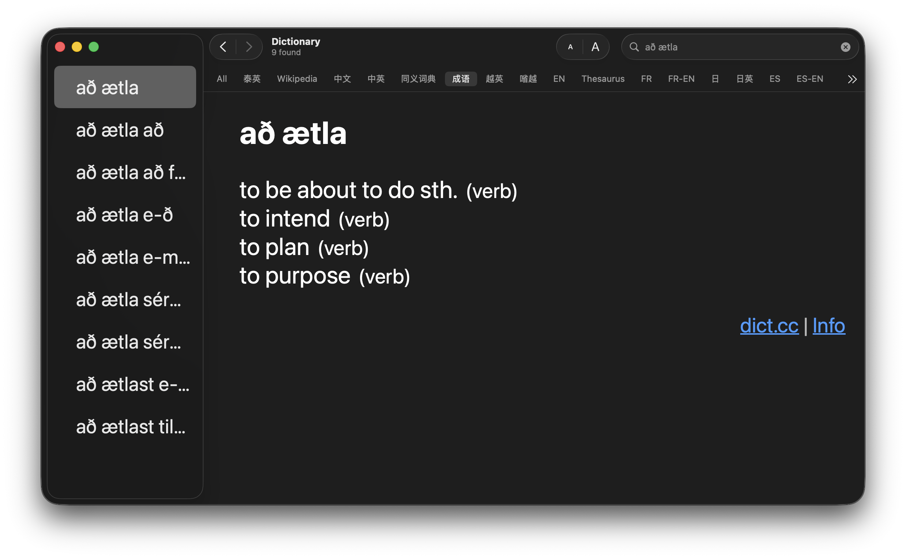

# Dict.cc Dictionary Generator for MacOS

 

This is a Python script to create a macOS dictionary from Dict.cc word lists. The generated dictionary is a regular dictionary for the macOS stock Dictionary app, which means you can also look up words using Spotlight or anywhere via 3-Finger-Tap.

 

## How to

1. You'll need to download a Dictionary text file from Dict.cc. You can request a download from: http://www1.dict.cc/translation_file_request.php
2. Download this repository, and place the text file you downloaded from Dict.cc into the same folder as the files downloaded from this repo
3. Name the text file according to the to the two character language codes for the language pair, e.g. "EN-DE.txt" if your dictionary is an English-German dictionary
4. Run this python script in the Terminal following the pattern of the below example command (if you don't have Python3 installed, do that first)
5. Once this script completes, you will find a .pkg file in a folder called "dist". Open this installer to install your dictionary into the Dictionary app
6. Now, if the Dictionary app is already opened, relaunch it
7. You should now be able to go to the settings for the Dictionary app and enable your new dictionary
8. Note: Dict.cc does not allow you to distribute their dictionary data. You can only use this on your own personal computers

### Example Command

This is an example command you could use if you were making an Icelandic to English dictionary. You will update all three parts of `IS-EN.txt IS-EN "Icelandic-English"` according to what you are doing. The first argument is the name of the text file you just renamed. The second argument is the two letter code names for the languages (this will show up as the short name in the Dictionary app). Then, the third argument is the long name of your dictionary, which will also display in the Dictionary app. 

`python3 createpackages.py -d IS-EN.txt IS-EN "Icelandic-English"`

 

## Project Credits

This is a fork made by Jeremy Edwards of a project originally developed by the below developers. I have only updated this to work with a more recent version of Python

Bernhard Caspar 
&nbsp;&nbsp;&nbsp;&nbsp;&nbsp;&nbsp;https://www.bernhardcaspar.de/dictcc

Philipp Brauner/Lipflip 
&nbsp;&nbsp;&nbsp;&nbsp;&nbsp;&nbsp;https://lipflip.org/articles/dictcc-dictionary-plugin 
&nbsp;&nbsp;&nbsp;&nbsp;&nbsp;&nbsp;https://lipflip.org/node/2096
   
Wolfgang Reszel 
&nbsp;&nbsp;&nbsp;&nbsp;&nbsp;&nbsp;http://www.tekl.de/deutsch/Lexikon-Plugins.html

Jeremy Edwards 
&nbsp;&nbsp;&nbsp;&nbsp;&nbsp;&nbsp;https://ebj.world/Homepage/Welcome!
   
## License
This project is released under GPL license
